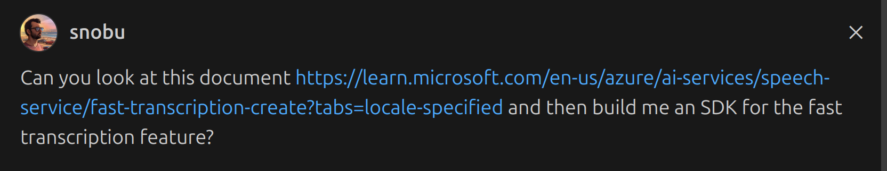

# Azure Speech-to-Text Transcription

A highly UNOFFICIAL Python SDK for the Azure Speech-to-Text API that allows simple audio file transcription, using the requests library and secure credential management via python-dotenv.

### WARNING - MAY NOT USE PROGRAMMING BEST PRACTICES
### Made by vibe coding with VSCode and GitHub Copilot in Agent Mode


## Features

- Easy-to-use client for Azure Speech-to-Text API
- Environment variable support for secure credential management
- Support for multiple audio file formats
- Configurable transcription settings including locale
- Command-line interface for quick transcription tasks

## Installation

1. Clone this repository:
   ```bash
   git clone <repository-url>
   cd fast-transcription
   ```

2. Install the required dependencies:
   ```bash
   pip install -r requirements.txt
   ```

3. Create a `.env` file in the root directory with your Azure Speech API credentials:
   ```
   AZURE_SPEECH_REGION=YourServiceRegion
   AZURE_SPEECH_KEY=YourSubscriptionKey
   ```

   Replace `YourServiceRegion` with your Azure region (e.g., `westus`, `eastus`) and `YourSubscriptionKey` with your Azure Speech service subscription key.
   
   A .env.sample file is provided with this project.

## Usage

### Using the SDK in your Python code

```python
from speech_client import AzureSpeechClient

# Initialize the client (will read credentials from .env file)
client = AzureSpeechClient()

# Transcribe an audio file
result = client.transcribe(
    audio_file="path/to/your/audio.wav",
    locales=["en-US"]
)

# Process the result
print(result)
```

### Advanced usage with custom configuration

```python
from config import AzureSpeechConfig
from speech_client import AzureSpeechClient

# Create a custom configuration
config = AzureSpeechConfig(
    region="westus",
    api_key="your-subscription-key",
    api_version="2024-11-15"
)

# Initialize client with custom configuration
client = AzureSpeechClient(config)

# Transcribe with additional options
result = client.transcribe(
    audio_file="path/to/your/audio.wav",
    locales=["en-US", "es-ES"],
    # Additional options can be passed as keyword arguments
)
```

### Using the command-line interface

The package includes a command-line script for quick transcription tasks:

```bash
python transcribe.py path/to/your/audio.wav
```

Command-line options:

```
usage: transcribe.py [-h] [--locale LOCALE] [--region REGION] [--api-key API_KEY] [--output OUTPUT] audio_file

Transcribe audio using Azure Speech-to-Text API

positional arguments:
  audio_file            Path to the audio file to transcribe

options:
  -h, --help            show this help message and exit
  --locale LOCALE, -l LOCALE
                        Locale for transcription (default: en-US)
  --region REGION, -r REGION
                        Azure region (overrides .env setting)
  --api-key API_KEY, -k API_KEY
                        API key (overrides .env setting)
  --output OUTPUT, -o OUTPUT
                        Output file for the transcription result
```

Examples:

```bash
# Basic usage with default locale (en-US)
python transcribe.py recordings/meeting.wav

# Specify a different locale
python transcribe.py recordings/interview.mp3 --locale fr-FR

# Save results to a JSON file
python transcribe.py recordings/lecture.wav --output results.json

# Override Azure region and API key from command line
python transcribe.py recordings/audio.wav -r westus -k your-subscription-key
```

## Supported Audio Formats

The SDK supports various audio formats including:
- WAV
- MP3
- OGG
- FLAC
- M4A
- WMA
- AAC

## Project Structure

- `config.py` - Configuration module for API settings and credentials
- `speech_client.py` - Core client implementation for making API requests
- `utils.py` - Utility functions for file validation and result formatting
- `transcribe.py` - Command-line interface for quick transcriptions
- `requirements.txt` - Python package dependencies

## License

[MIT License](LICENSE)
